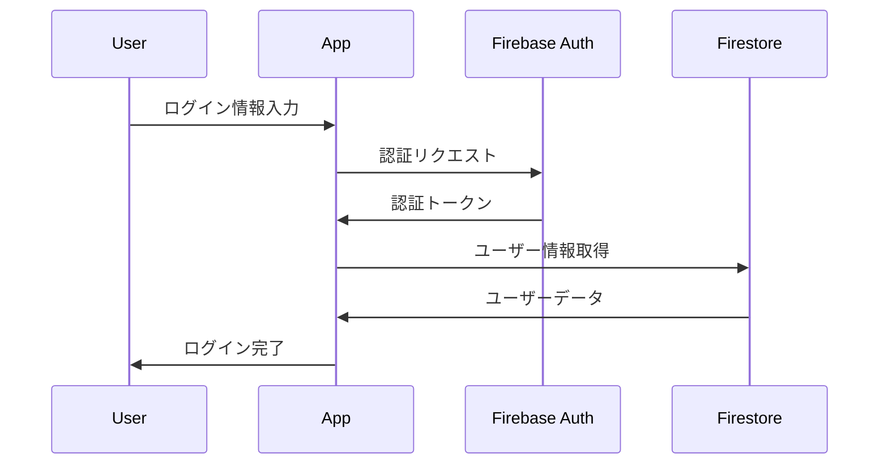
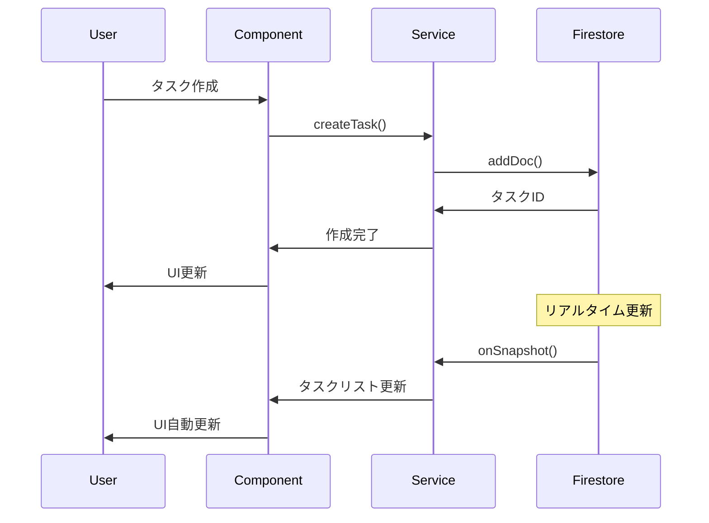

# システム アーキテクチャ設計書

## 概要

Shiftize は、React Native for Web と Firebase Firestore を基盤とした、モダンな Web アプリケーションです。マルチテナント（多店舗）対応のシフト管理・タスク管理システムとして設計されています。

## 1. 全体アーキテクチャ

### 1.1 システム構成図

```text
┌─────────────────────────────────────────────────────────────┐
│                        Frontend                             │
│  ┌─────────────────┐  ┌─────────────────┐  ┌─────────────────┐ │
│  │  React Native   │  │     Expo        │  │   TypeScript    │ │
│  │   for Web       │  │    Router       │  │     Types       │ │
│  └─────────────────┘  └─────────────────┘  └─────────────────┘ │
│  ┌─────────────────┐  ┌─────────────────┐  ┌─────────────────┐ │
│  │  React Native   │  │     Zustand     │  │   React Query   │ │
│  │   Elements      │  │  State Manager  │  │   Cache Layer   │ │
│  └─────────────────┘  └─────────────────┘  └─────────────────┘ │
└─────────────────────────────────────────────────────────────┘
                                │
                                │ HTTPS/WebSocket
                                │
┌─────────────────────────────────────────────────────────────┐
│                        Backend                              │
│  ┌─────────────────┐  ┌─────────────────┐  ┌─────────────────┐ │
│  │   Firebase      │  │   Firestore     │  │   Firebase      │ │
│  │ Authentication  │  │   Database      │  │   Storage       │ │
│  └─────────────────┘  └─────────────────┘  └─────────────────┘ │
│  ┌─────────────────┐  ┌─────────────────┐  ┌─────────────────┐ │
│  │   Cloud         │  │   Security      │  │   Analytics     │ │
│  │   Functions     │  │    Rules        │  │   Monitoring    │ │
│  └─────────────────┘  └─────────────────┘  └─────────────────┘ │
└─────────────────────────────────────────────────────────────┘
                                │
                                │ CDN/Edge
                                │
┌─────────────────────────────────────────────────────────────┐
│                    Deployment                               │
│  ┌─────────────────┐  ┌─────────────────┐  ┌─────────────────┐ │
│  │     Vercel      │  │   Firebase      │  │     Domain      │ │
│  │   Hosting       │  │   Hosting       │  │   Management    │ │
│  └─────────────────┘  └─────────────────┘  └─────────────────┘ │
└─────────────────────────────────────────────────────────────┘
```

### 1.2 技術スタック

#### フロントエンド

- **React Native for Web**: クロスプラットフォーム対応
- **TypeScript**: 型安全性とコード品質
- **Expo Router**: ファイルベースルーティング
- **React Native Elements**: UI コンポーネント
- **Zustand**: 軽量状態管理

#### バックエンド

- **Firebase Firestore**: NoSQL データベース
- **Firebase Authentication**: 認証サービス
- **Firebase Storage**: ファイルストレージ
- **Cloud Functions**: サーバーレス関数

#### インフラ

- **Vercel**: 本番環境ホスティング
- **Firebase Hosting**: 静的ファイルホスティング
- **CDN**: グローバル配信最適化

## 2. フロントエンド アーキテクチャ

### 2.1 ディレクトリ構造

```text
src/
├── app/                    # Expo Router ベースのページ
│   ├── (auth)/            # 認証関連ページ
│   │   ├── _layout.tsx
│   │   └── login/
│   └── (main)/            # メインアプリケーション
│       ├── _layout.tsx
│       ├── master/        # 管理者機能
│       └── user/          # ユーザー機能
├── common/                # 共通コンポーネント・ユーティリティ
│   ├── common-constants/  # 定数定義
│   ├── common-models/     # 型定義
│   ├── common-theme/      # テーマ設定
│   ├── common-ui/         # 再利用可能コンポーネント
│   └── common-utils/      # ユーティリティ関数
├── modules/               # 機能別モジュール
│   ├── home-view/         # ホーム画面
│   ├── login-view/        # ログイン画面
│   ├── master-view/       # 管理者画面
│   │   ├── kanban-task/   # タスク管理
│   │   └── shift-create/  # シフト作成
│   └── user-view/         # ユーザー画面
├── services/              # 外部サービス連携
│   ├── auth/              # 認証サービス
│   └── firebase/          # Firebase サービス
└── types/                 # 型定義
```

### 2.2 レイヤー アーキテクチャ

```text
┌─────────────────────────────────────────────────────────────┐
│                    Presentation Layer                       │
│  ┌─────────────────┐  ┌─────────────────┐  ┌─────────────────┐ │
│  │     Pages       │  │   Components    │  │     Hooks       │ │
│  │  (app/routes)   │  │   (modules/)    │  │  (useAuth, etc) │ │
│  └─────────────────┘  └─────────────────┘  └─────────────────┘ │
└─────────────────────────────────────────────────────────────┘
                                │
┌─────────────────────────────────────────────────────────────┐
│                    Business Layer                           │
│  ┌─────────────────┐  ┌─────────────────┐  ┌─────────────────┐ │
│  │   Services      │  │   Utilities     │  │   Validation    │ │
│  │  (services/)    │  │ (common-utils/) │  │   (schemas)     │ │
│  └─────────────────┘  └─────────────────┘  └─────────────────┘ │
└─────────────────────────────────────────────────────────────┘
                                │
┌─────────────────────────────────────────────────────────────┐
│                      Data Layer                             │
│  ┌─────────────────┐  ┌─────────────────┐  ┌─────────────────┐ │
│  │   Firebase      │  │     Cache       │  │   Local         │ │
│  │   Services      │  │   Management    │  │   Storage       │ │
│  └─────────────────┘  └─────────────────┘  └─────────────────┘ │
└─────────────────────────────────────────────────────────────┘
```

### 2.3 状態管理

#### Zustand ストア構成

```typescript
// 認証状態
interface AuthStore {
  user: User | null;
  isAuthenticated: boolean;
  login: (credentials: LoginCredentials) => Promise<void>;
  logout: () => Promise<void>;
  checkAuth: () => Promise<void>;
}

// アプリケーション状態
interface AppStore {
  currentStoreId: string;
  theme: ThemeConfig;
  language: Language;
  setCurrentStore: (storeId: string) => void;
  setTheme: (theme: ThemeConfig) => void;
}

// タスク状態
interface TaskStore {
  tasks: NormalTask[];
  selectedTask: NormalTask | null;
  filters: TaskFilters;
  fetchTasks: (storeId: string) => Promise<void>;
  createTask: (task: TaskFormData) => Promise<void>;
  updateTask: (id: string, updates: Partial<NormalTask>) => Promise<void>;
}
```

## 3. バックエンド アーキテクチャ

### 3.1 データベース設計

#### Firestore コレクション構造

```text
firestore/
├── users/                 # ユーザー情報
│   └── {userId}/
│       ├── profile        # プロフィール情報
│       ├── storeAccess    # 店舗アクセス権限
│       └── preferences    # 個人設定
├── stores/                # 店舗情報
│   └── {storeId}/
│       ├── config         # 店舗設定
│       ├── members        # メンバー一覧
│       └── metadata       # メタデータ
├── shifts/                # シフト情報
│   └── {shiftId}/
│       ├── basic          # 基本情報
│       ├── tasks          # 関連タスク
│       └── history        # 変更履歴
├── NormalTasks/           # タスク管理
│   └── {taskId}/
│       ├── basic          # 基本情報
│       ├── assignees      # 担当者
│       └── metadata       # メタデータ
├── TaskMemos/             # タスクメモ
│   └── {memoId}/
│       ├── content        # メモ内容
│       ├── author         # 作成者
│       └── timestamp      # 作成時間
├── auditLogs/             # 監査ログ
├── securityLogs/          # セキュリティログ
└── notifications/         # 通知情報
```

### 3.2 セキュリティ Rules

```javascript
// 階層的なセキュリティルール
rules_version = '2';
service cloud.firestore {
  match /databases/{database}/documents {
    // 共通関数群
    function isAuthenticated() {
      return request.auth != null;
    }

    function isOwner(userId) {
      return request.auth.uid == userId;
    }

    function hasStoreAccess(storeId) {
      return isAuthenticated() &&
             exists(/databases/$(database)/documents/userStoreAccess/$(request.auth.uid)) &&
             get(/databases/$(database)/documents/userStoreAccess/$(request.auth.uid)).data.storesAccess[storeId] != null;
    }

    function isMaster(storeId) {
      return hasStoreAccess(storeId) &&
             get(/databases/$(database)/documents/userStoreAccess/$(request.auth.uid)).data.storesAccess[storeId].role == 'master';
    }

    // ユーザー関連
    match /users/{userId} {
      allow read: if isAuthenticated();
      allow write: if isOwner(userId) || isMaster(resource.data.storeId);
    }

    // 店舗関連
    match /stores/{storeId} {
      allow read: if hasStoreAccess(storeId);
      allow write: if isMaster(storeId);
    }

    // シフト関連
    match /shifts/{shiftId} {
      allow read: if hasStoreAccess(resource.data.storeId);
      allow write: if hasStoreAccess(resource.data.storeId) &&
                     (isOwner(resource.data.userId) || isMaster(resource.data.storeId));
    }

    // タスク関連
    match /NormalTasks/{taskId} {
      allow read, write: if hasStoreAccess(resource.data.storeId);
    }

    // メモ関連
    match /TaskMemos/{memoId} {
      allow read, write: if hasStoreAccess(
        get(/databases/$(database)/documents/NormalTasks/$(resource.data.taskId)).data.storeId
      );
    }
  }
}
```

## 4. データフロー

### 4.1 認証フロー



### 4.2 タスク操作フロー



### 4.3 リアルタイム同期

```typescript
// リアルタイム同期の実装例
const useRealtimeSync = (storeId: string) => {
  const [tasks, setTasks] = useState<NormalTask[]>([]);

  useEffect(() => {
    if (!storeId) return;

    const unsubscribe = normalTaskService.watchTasks(
      storeId,
      (updatedTasks) => {
        setTasks(updatedTasks);
      }
    );

    return unsubscribe;
  }, [storeId]);

  return tasks;
};
```

## 5. パフォーマンス最適化

### 5.1 フロントエンド最適化

#### コード分割

```typescript
// 動的インポートによる遅延読み込み
const KanbanTaskView = lazy(() => import("./KanbanTaskView"));
const TaskManagementView = lazy(() => import("./TaskManagementView"));

// ルートレベルでの分割
const MasterRoutes = lazy(() => import("./routes/MasterRoutes"));
const UserRoutes = lazy(() => import("./routes/UserRoutes"));
```

#### メモ化

```typescript
// useMemo による計算結果のキャッシュ
const filteredTasks = useMemo(() => {
  return tasks.filter(
    (task) =>
      task.status === selectedStatus &&
      task.title.toLowerCase().includes(searchTerm.toLowerCase())
  );
}, [tasks, selectedStatus, searchTerm]);

// useCallback による関数のメモ化
const handleTaskUpdate = useCallback(
  (taskId: string, updates: Partial<NormalTask>) => {
    return normalTaskService.updateTask(taskId, updates);
  },
  []
);
```

### 5.2 バックエンド最適化

#### クエリ最適化

```typescript
// 複合インデックスを活用した効率的なクエリ
const getTasksByStoreAndStatus = (storeId: string, status: TaskStatus) => {
  return query(
    collection(db, "NormalTasks"),
    where("storeId", "==", storeId),
    where("status", "==", status),
    orderBy("lastActionAt", "desc"),
    limit(20)
  );
};
```

#### データ構造の最適化

```typescript
// 非正規化によるクエリ性能向上
interface OptimizedTask {
  id: string;
  title: string;
  status: TaskStatus;
  storeId: string;
  // よくアクセスされるフィールドを非正規化
  createdByName: string;
  lastActionAt: Date;
  // 重いデータは別コレクションに
  detailsRef: string; // 詳細情報への参照
}
```

## 6. スケーラビリティ対応

### 6.1 水平スケーリング

#### データ分割戦略

```typescript
// 店舗別データ分割
const getShardedCollection = (storeId: string, collectionName: string) => {
  const shardId = storeId.slice(-1); // 最後の文字でシャード決定
  return collection(db, `${collectionName}_shard_${shardId}`);
};

// 時間ベース分割
const getTimeBasedCollection = (date: Date, collectionName: string) => {
  const year = date.getFullYear();
  const month = date.getMonth() + 1;
  return collection(db, `${collectionName}_${year}_${month}`);
};
```

### 6.2 キャッシュ戦略

#### React Query による キャッシュ

```typescript
// クエリキャッシュの設定
const queryClient = new QueryClient({
  defaultOptions: {
    queries: {
      staleTime: 5 * 60 * 1000, // 5分
      cacheTime: 10 * 60 * 1000, // 10分
    },
  },
});

// タスク取得のキャッシュ
const useTasksQuery = (storeId: string) => {
  return useQuery({
    queryKey: ["tasks", storeId],
    queryFn: () => normalTaskService.getTasks(storeId),
    enabled: !!storeId,
  });
};
```

## 7. 監視とログ

### 7.1 アプリケーション監視

```typescript
// パフォーマンス監視
const performanceMonitor = {
  trackPageLoad: (pageName: string) => {
    const startTime = performance.now();

    return () => {
      const endTime = performance.now();
      const loadTime = endTime - startTime;

      // Firebase Analytics にログ送信
      logEvent(analytics, "page_load_time", {
        page_name: pageName,
        load_time: loadTime,
      });
    };
  },

  trackUserAction: (action: string, metadata?: Record<string, any>) => {
    logEvent(analytics, "user_action", {
      action,
      ...metadata,
      timestamp: new Date().toISOString(),
    });
  },
};
```

### 7.2 エラー監視

```typescript
// グローバルエラーハンドリング
const errorHandler = {
  handleError: (error: Error, context: string) => {
    console.error(`[${context}] Error:`, error);

    // エラーログをFirestoreに保存
    addDoc(collection(db, "errorLogs"), {
      message: error.message,
      stack: error.stack,
      context,
      timestamp: Timestamp.now(),
      userId: auth.currentUser?.uid,
      userAgent: navigator.userAgent,
    });
  },

  handleAsyncError: async (promise: Promise<any>, context: string) => {
    try {
      return await promise;
    } catch (error) {
      errorHandler.handleError(error as Error, context);
      throw error;
    }
  },
};
```

## 8. デプロイメント アーキテクチャ

### 8.1 CI/CD パイプライン

```yaml
# .github/workflows/deploy.yml
name: Deploy to Production

on:
  push:
    branches: [main]

jobs:
  build-and-deploy:
    runs-on: ubuntu-latest
    steps:
      - uses: actions/checkout@v2

      - name: Setup Node.js
        uses: actions/setup-node@v2
        with:
          node-version: "18"

      - name: Install dependencies
        run: npm ci

      - name: Run tests
        run: npm test

      - name: Build
        run: npm run build

      - name: Deploy to Vercel
        uses: vercel/deploy-action@v1
        with:
          vercel-token: ${{ secrets.VERCEL_TOKEN }}
          vercel-project-id: ${{ secrets.VERCEL_PROJECT_ID }}
```

### 8.2 環境別設定

```typescript
// 環境設定の管理
const config = {
  development: {
    apiUrl: "https://dev-api.example.com",
    firebase: {
      apiKey: process.env.NEXT_PUBLIC_FIREBASE_API_KEY_DEV,
      authDomain: "shiftize-dev.firebaseapp.com",
    },
    debug: true,
  },

  production: {
    apiUrl: "https://api.example.com",
    firebase: {
      apiKey: process.env.NEXT_PUBLIC_FIREBASE_API_KEY_PROD,
      authDomain: "shiftize-prod.firebaseapp.com",
    },
    debug: false,
  },
};

export const getConfig = () => {
  const env = process.env.NODE_ENV || "development";
  return config[env as keyof typeof config];
};
```

## 9. まとめ

このシステムアーキテクチャは、以下の特徴を持ちます：

### 利点

- **スケーラビリティ**: 多店舗対応とデータ分割戦略
- **保守性**: モジュラー設計と明確な責任分離
- **セキュリティ**: 多層防御とアクセス制御
- **パフォーマンス**: 最適化されたクエリとキャッシュ戦略
- **リアルタイム性**: Firestore の onSnapshot による即座の同期

### 今後の拡張性

- マイクロサービス化への移行対応
- 国際化対応
- モバイルアプリとの統合
- 高度な分析機能の追加

この設計により、中小規模から大規模まで対応可能な、堅牢で拡張性の高いシステムを実現しています。
